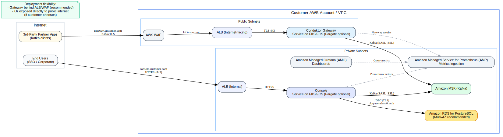

# Overview

## [Quickstart Guide for Running Conduktor on MSK](docker-quickstart-msk/README.md)

## [Set up Console](https://docs.conduktor.io/guide/tutorials/deploy-aws#overview)
* *make sure that console can reach gateway by setting it up on a public vpc or reachable vpc* 
* [make sure to set up rds postgres and s3](https://docs.conduktor.io/guide/conduktor-in-production/deploy-artifacts//deploy-console/kubernetes#production-requirements)
* [if you need to set up promethues and grafana scraping](https://github.com/conduktor/conduktor-public-charts/blob/main/charts/console/README.md#install-with-console-technical-monitoring)

* [Setting up MSK with IAM](https://docs.conduktor.io/guide/conduktor-in-production/deploy-artifacts/deploy-console/sample-config#amazon-msk-with-iam-authentication-example)
* [Setting up AWSK MSK with Glue Schema Registry](https://docs.conduktor.io/guide/conduktor-in-production/deploy-artifacts/deploy-console/sample-config#amazon-msk-with-glue-schema-registry)

## [Set up Gateway](gateway-confluent-cloud/README.md)

* [Configuring connectivity from Gateway to IAM](https://docs.conduktor.io/guide/conduktor-in-production/deploy-artifacts/deploy-gateway/index#aws-msk-cluster-with-iam)
