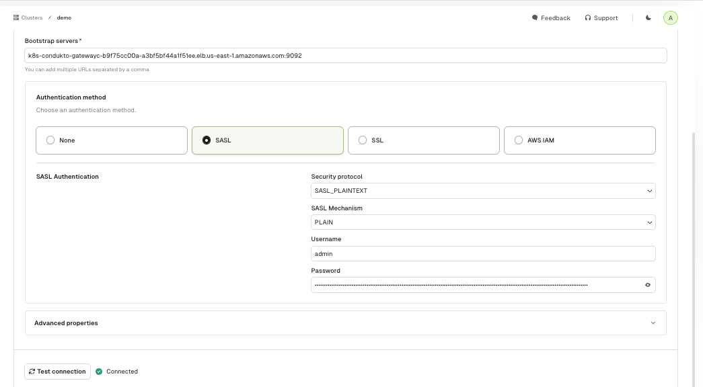
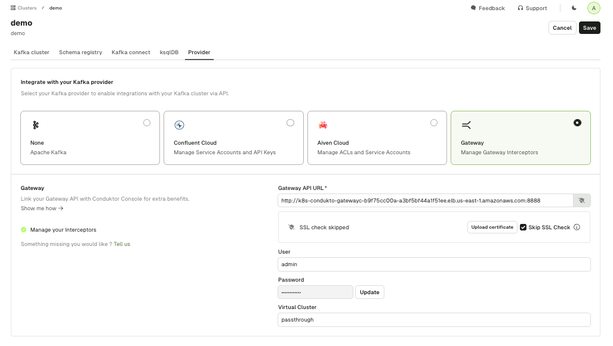

# Setting up Exchange on Kubernetes (AWS)

1. Set up the gateway to be atleast SASL

2. Get the API admin details

You will see this when you run the environment

```
export ADMIN_LOGIN="$(kubectl get secret gateway-conduktor-gateway-secret -n conduktor -o jsonpath="{.data.GATEWAY_ADMIN_API_USER_0_USERNAME}" | base64 --decode)"
export ADMIN_PASSWORD="$(kubectl get secret gateway-conduktor-gateway-secret -n conduktor -o jsonpath="{.data.GATEWAY_ADMIN_API_USER_0_PASSWORD}" | base64 --decode)"
export LB_DNS=$(kubectl get svc gateway-conduktor-gateway-external -n conduktor -o jsonpath='{.status.loadBalancer.ingress[0].hostname}')
```

save the results and export it 

3. Set up the CLI

[install the cli](https://docs.conduktor.io/platform/reference/cli-reference/)

configure the environment variables from the output above, you can refer to start.sh

```
export CDK_GATEWAY_BASE_URL=http://$LB_DNS:8888
export CDK_GATEWAY_USER=$ADMIN_LOGIN
export CDK_GATEWAY_PASSWORD=$ADMIN_PASSWORD
```

4. create the partner zone service account

```
conduktor apply -f pz_admin_sa.yaml 
```

5. create the token for the service account

```
export SA_TOKEN_PASSWWORD=$(conduktor run generateServiceAccountToken  --life-time-seconds 999999 --username admin --v-cluster passthrough | jq -r .token)
```

6. add gateway to console

 - add the cluster to gateway using your service account token

 

 - add the gateway provider type, use the admin api password from the beginning of these instructions

 

 at this point your should be able to add a partner zone


7. BONUS - check the kafka cluster

```

cat <<EOF | envsubst > client.properties
security.protocol=SASL_PLAINTEXT
sasl.mechanism=PLAIN
sasl.jaas.config=org.apache.kafka.common.security.plain.PlainLoginModule required \
  username="\$CDK_GATEWAY_USER" \
  password="\$SA_TOKEN_PASSWWORD";
EOF

kafka-topics --bootstrap-server $LB_DNS:9093 --command-config client.properties --list
```

8. BONUS - add interceptors

```
./add_vault.sh
conduktor apply -f resources/interceptors/encrypt-orders.yaml
```


